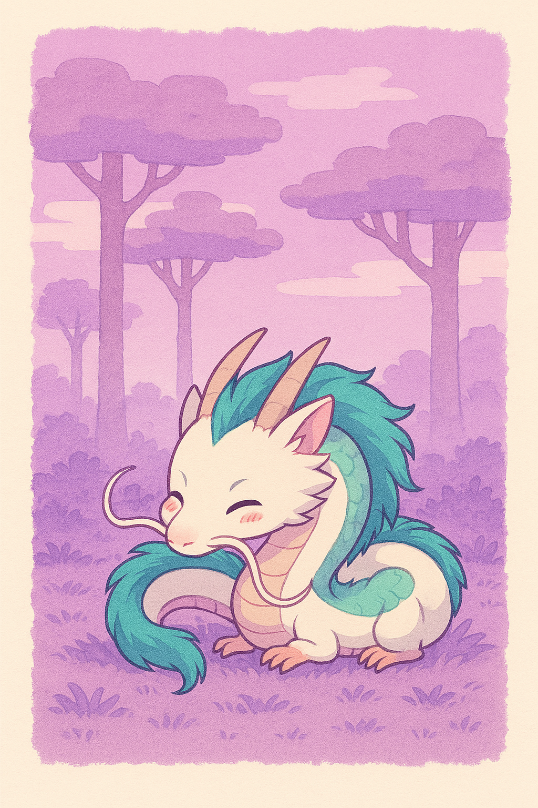
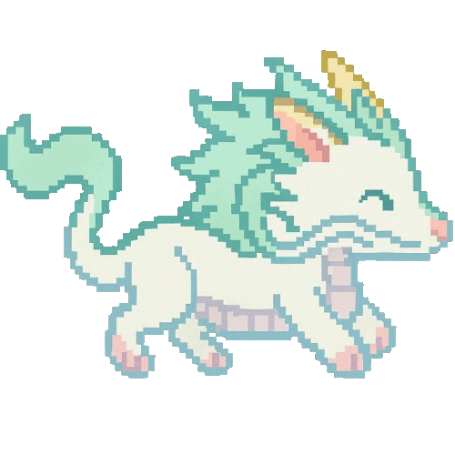

<pre>
🌱  Currently learning data modeling with Python
🎨 I love coding & cute pixel art
📫 amayasheila63@gmail.com
</pre>

  

  

## 💻 Languages and Tools
### 🧠 Languages

### 🧩 Frameworks & Libraries

### 🔧 Tools & Platforms

### 🎨 Design

  

## 📎 My Stats

  
<b>🔥 GitHub Streak</b>

   
  

  
<b>⚡ GitHub Profile Stats</b>

   
  

    
  

  
<b>🏆 GitHub Trophies</b>

   
  

    
  

  

## ✍️ Quote of the Day

  

  
